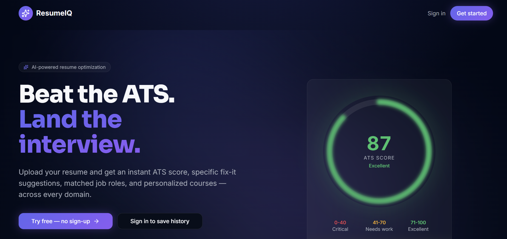
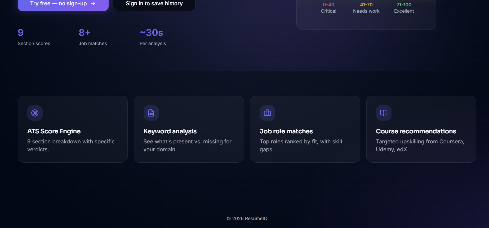
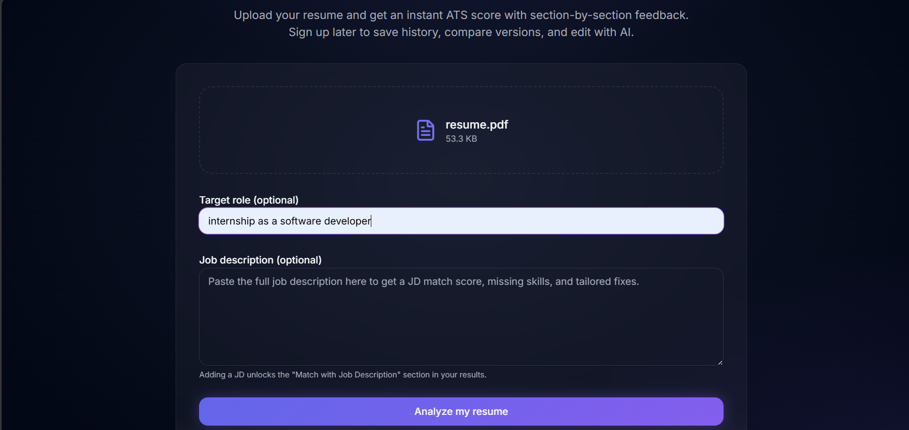
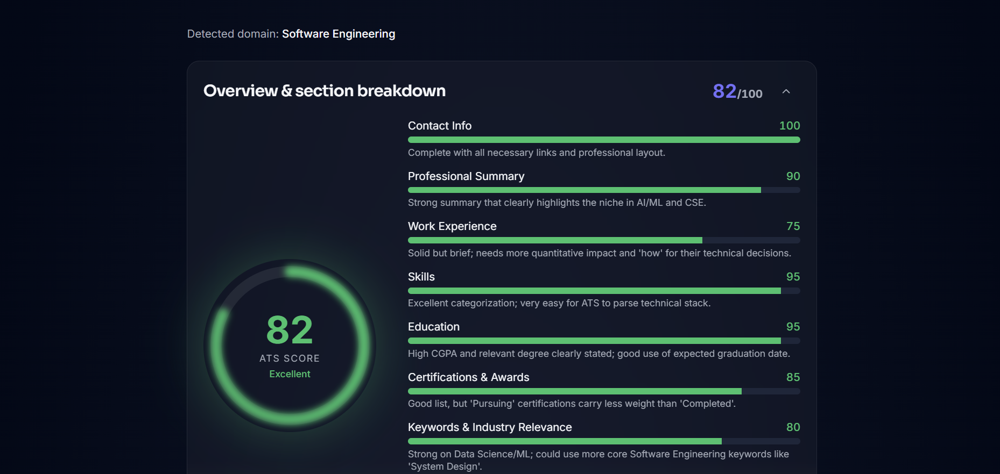
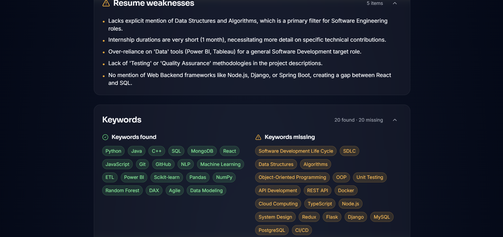
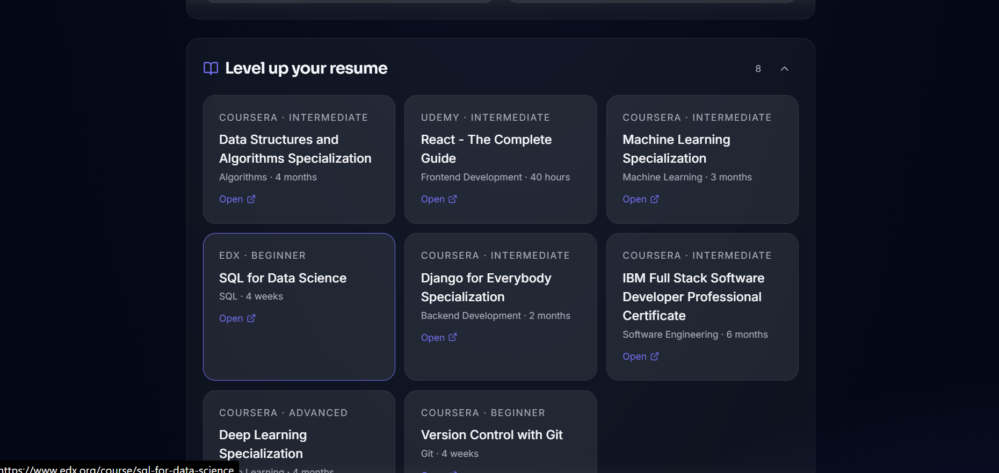
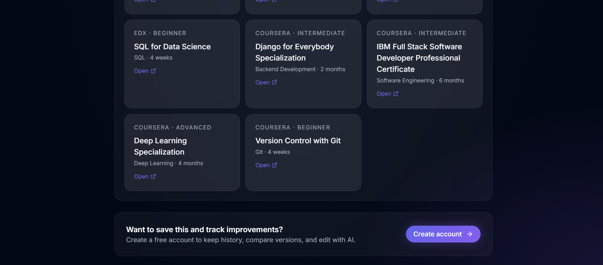

# ResumeIQ — Beat the ATS. Land the Interview.

[](https://opensource.org/licenses/MIT)
[](https://react.dev)
[](https://www.typescriptlang.org)
[](https://supabase.com)
[](https://tailwindcss.com)

> An AI-powered resume analyzer that instantly scores your resume against ATS systems, identifies keyword gaps, matches you to job roles, and recommends courses to close the skill gap — across every domain.

🔗 **Live Demo:** [https://preview--resume-ace-073.lovable.app/](https://preview--resume-ace-073.lovable.app/)

---

## 📸 Screenshots

### 🏠 Landing Page



### 📤 Resume Upload & Analysis


### 📊 ATS Score & Section Breakdown


### ⚠️ Resume Weaknesses & Keywords


### 🛠️ Improvement Suggestions


### 💼 Matched Job Roles


### 📚 Course Recommendations



---

## ✨ Features

- **ATS Score Engine** — Instant 0–100 score with a 9-section breakdown covering Contact Info, Summary, Experience, Skills, Education, Certifications, Keywords, Formatting, and Grammar
- **Keyword Analysis** — Color-coded pills showing exactly which domain keywords are present vs. missing
- **Resume Weaknesses** — Specific, actionable weakness detection with priority tags (Critical / Important / Nice to Have)
- **Improvement Suggestions** — Section-by-section fix instructions with clear reasoning
- **Job Role Matching** — Top roles ranked by fit percentage, with skill gaps and salary ranges
- **Course Recommendations** — Curated upskilling picks from Coursera, Udemy, edX, and more — tailored to your gaps
- **Target Role Input** — Enter your target job role for a more focused, tailored analysis
- **Job Description Match** — Paste any JD to get a fit score, missing skills, and targeted improvements
- **AI Rewriter** — Section-by-section rewrite with accept/reject diffs powered by a TipTap rich text editor
- **Google OAuth** — One-click sign-in with persistent sessions
- **Version History** — Save every resume version and re-analyze on demand
- **Try Without Sign-in** — Full analysis available on the `/try` route, no account required

---

## 🧱 Tech Stack

| Layer | Technology |
|---|---|
| Framework | TanStack Start (React 19, file-based routing) |
| Language | TypeScript |
| Styling | Tailwind CSS v4 — custom Midnight Pro design system |
| UI Components | shadcn/ui, lucide-react, Framer Motion |
| Rich Text Editor | TipTap |
| Backend & Auth | Supabase (Postgres, Auth, Storage, RLS) |
| AI | Google Gemini via Vercel AI SDK |
| Build Tool | Vite 7 + Bun |
| Testing | Vitest (unit), Playwright (E2E) |

---

## 🚀 Run Locally

```bash
# 1. Clone the repository
git clone https://github.com/CHARUMATHID380/resumeiq.git
cd resumeiq

# 2. Install dependencies
bun install
# or: npm install

# 3. Set up environment variables
cp .env.example .env
# Fill in your values (see below)

# 4. Start the dev server
bun run dev
# or: npm run dev
```

App runs at [http://localhost:8080](http://localhost:8080)

---

## 🔐 Environment Variables

```env
# Supabase — get from your Supabase project settings
VITE_SUPABASE_URL=your-supabase-project-url
VITE_SUPABASE_PUBLISHABLE_KEY=your-supabase-anon-key
VITE_SUPABASE_PROJECT_ID=your-supabase-project-id

# Server-side only
SUPABASE_URL=your-supabase-project-url
SUPABASE_PUBLISHABLE_KEY=your-supabase-anon-key
SUPABASE_SERVICE_ROLE_KEY=your-supabase-service-role-key

# AI Gateway
AI_GATEWAY_KEY=your-ai-gateway-api-key
```

> No secrets are hardcoded anywhere in the source. Everything is read from `.env` or your hosting provider's secret manager.

---

## 🧪 Tests

```bash
# Unit tests
bunx vitest run

# End-to-end tests (requires dev server running)
bunx playwright test
```

---

## 📁 Project Structure

```
src/
├── components/          # Reusable UI components
│   ├── ui/              # shadcn/ui base components
│   ├── ATSGauge.tsx     # Animated ATS score ring
│   ├── AnalysisResults.tsx
│   └── AppShell.tsx
├── routes/              # File-based pages
│   ├── index.tsx        # Landing page
│   ├── try.tsx          # Guest analysis page
│   ├── auth.tsx         # Google OAuth
│   └── _authenticated/  # Protected routes
│       ├── dashboard.tsx
│       ├── upload.tsx
│       ├── analysis.$id.tsx
│       ├── editor.$id.tsx
│       └── history.tsx
├── lib/                 # Business logic & server functions
├── integrations/        # Supabase client & auth
└── styles.css           # Global styles & design tokens
```

---

## 🤝 Contributing

Pull requests are welcome! For major changes, please open an issue first to discuss what you'd like to change.

1. Fork the repo
2. Create your feature branch (`git checkout -b feature/AmazingFeature`)
3. Commit your changes (`git commit -m 'Add AmazingFeature'`)
4. Push to the branch (`git push origin feature/AmazingFeature`)
5. Open a Pull Request

---

## 📄 License

MIT © [ResumeIQ](https://github.com/CHARUMATHID380/resumeiq)
